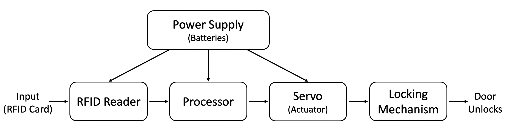

# Smart RFID Door Lock Project Design Requirements and Specifications

Authors:
Miles Breslin, Miguel Higgins Moy, Noah Page, John Sharpe

December 8, 2020

<<<<<<< HEAD
Version 5.1

# Need Statement

The global smartlock industry was estimated to be valued at 1.2 billion dollars in 2019. The recent invention of the smartlock has given homeowners or renters a greater number of ways to gain access to their home securely. RFID based smartlocks in particular are convenient due to the cheap cost of RFID cards, ease of programmability, and their ability to interface with the RFID features available in most Android smartphones. Many smartlocks available today require monthly subscriptions and internet connections to function, can be expensive, and don't always work with standard door mechanisms. A new doorlock system is needed that is less expensive, can read RFID inputs, functions with normal doorlock assemblies, and does not require a monthly subscription to operate.
=======
Version 4.0

# Need Statement

The Internet of Things has infiltrated the home security market including smart locks for your front door. The RFID based locking system is a more convenient interface than the IOT devices, however, the RFID market is still mainly a commercial application and a very expensive one at that. As people begin to modernize their homes we think there is a need for the convenience provided by the RFID sensor that may also have other smart features.
>>>>>>> 8a13dbc (Total reorganization of files and file names)

# Objective Statement

The objective of this project is to make an RFID smart door lock mechanism for residential use that is secure, easy to install, low cost, and that will work with standard doorlock mechanisms. This would offer customers the versatility of entering their homes using a normal key, or an RFID enabled phone, implant, or keycard. By tapping the RFID card against the RFID reader on the outside of the door, the user can easily toggle between locking and unlocking the door. 

# Market Analysis

Solution 1 - Level Bolt

* Not visible on the outside/inside of the door
* Great battery life
* Easy battery changes
* Bluetooth only
* Lacks internet connectivity
* Lacks an RFID/NFC sensor
* Depends on Bolt app and server support
* Expensive! - $229

Solution 2 - August Wi-Fi Smart Lock

* Not visible on the outside of the door
* Easiest installation
* Great battery life
* Easy battery changes
* Not compatible with all doors
* Wifi and Bluetooth only
* Lacks an RFID/NFC sensor
* Depends on August app and server support
* Expensive! - $249.99

Solution 3 - Most other smart locks

* Replaces entire lock assembly
* Has a pin-pad on the outside (therefore ugly and not discrete)
* Not always able to use existing lock
* Lacks an RFID/NFC sensor
* Less expensive, but still over $100

The smart lock solutions listed here do not use RFID/NFC as a method for unlocking, and existing solutions that do use RFID are mainly focused on enterprise customers who are able to build out integrated locking methods into the door and frame that require a central controller for multiple doors. These methods are not only expensive, but not feasible for a standard consumer. Our design will offer standard consumers an RFID enabled smart lock that does not require a subscription at a lower price than most other smart locks, which start at around $150. Our current estimate on parts is about $60, so we feel that we could sell the product for around $100. This price is well below our competition and leaves us some headroom to increase the price if production costs exceed our current estimate.

# Requirements

<<<<<<< HEAD
Functionality

* Must be able to work with existing doors
* Must lock and unlock a door
* Must be able to work without an internet connection
* Should be able to work with existing locks
* Should be able to lock/unlock from the inside by physical means
* Should still allow for locking/unlocking with a normal key
* May have smart home integration

Performance

* Should reliably sense RFID on first try > 90% of the time

Economic

* Should be cheaper than most market offerings (<$130)

Energy

* Should be able to work during a power outage

* May have enough battery capacity for regular use that will last a month

Maintainability

* Should be installed with 2mm and 2.5mm hex wrench and phillips head screwdriver by homeowner

Reliability

* Should be durable enough to last more than a year with regular use

Usability

* May be easy to assemble
=======
* Must lock and unlock a door
* Must be able to work with existing doors
* Must be able to work without an internet connection
* Should be able to work with existing locks
* Should be able to use a normal key
* Should be able to lock/unlock from the inside by physical means
* Should be durable enough to last more than a year with regular use
* Should be cheaper than market offerings (<$150)
* Should be able to work during a power outage
* Should reliably sense RFID on first try 90% of the time
* Should be installed with 2mm and 2.5mm hex wrench and philips head screwdriver by homeowner
* May have enough battery capacity for regular use that will last a month
* May have smart home integration
>>>>>>> 8a13dbc (Total reorganization of files and file names)

# System Architecture

### RFID Door Lock Block Diagram

# Design Specification

* 3D printed housing that does not affect the structural integrity of the existing lock
* Custom PCB for ESP-12F Module to connect actuator and sensor
* Servo as the actuator
* RC-522 module located on the outside of the door
* AA battery powered
* Programmed in Arduino IDE
# Practicum Design Specification
### MUST
#### Project Concept
* Have ≥ 1 sensor.
* Have ≥ 1 actuator.
* Have a digital or analog processor.
* Has to be safe.
#### Schematic
* Be in a schematic capture program.
* Be at least forward annotated with your PCB design.
#### PCB
* Have ≥ 2 layers, with solder mask and at least a top-side silk screen.
* Have an area between > 9 cm 2 and < 900 cm 2 .
* Have no linear dimension < 2 cm or > 30 cm.
#### Processor
* Have the processor on your PCB 
* Be able to program your processor without removing the processor from the PCB.
#### Components
* Have ≥ 25% surface mount components.

#### Assembly and debug
* Be assembled by hand 
* Be tested.
#### Work
* At least one breadboard prototype must work
* You will receive 4 PCBs back from manufacturing; at least 1 must work.
#### Documentation
* Have live documentation.
* Have all documentation and design files under revision control.
* Use collaborative documentation tools
### SHOULD
#### Project Concept
* Have a novel or interesting purpose.
* Be packaged in an enclosure.
* Have more complex sensors and actuators.
#### Firmware
* Be “bare metal”, with no 3rd party code used besides an IDE and vendor-provided libraries.
#### PCB
* Be as small as possible.
#### Components
* Have almost all surface mount components.
#### Assembly and debug
* Use reflow soldering (requires a stencil and solder paste).
* Use SMT components that are not hard to hand assemble.
* All parts ≥ 0603, no or very few QFNs, no BGAs, etc.
#### Documentation
* Use your collaboration tool's issue tracking system.
* Have each component choice documented.
### MAY
#### Project Concept
* Move / Explode.
* Have a cool custom enclosure or mechanism.
* Be aesthetically pleasing.
#### Processor
* Start from the
    * ATMega328 
    * ATMega32U4 
#### Schematic
* Use EAGLE CAD 
#### PCB
* Use EAGLE CAD 
#### Documentation
* Use Github for collaboration (supported in ECE411).
* Have a video describing concept, use, and technology overview.