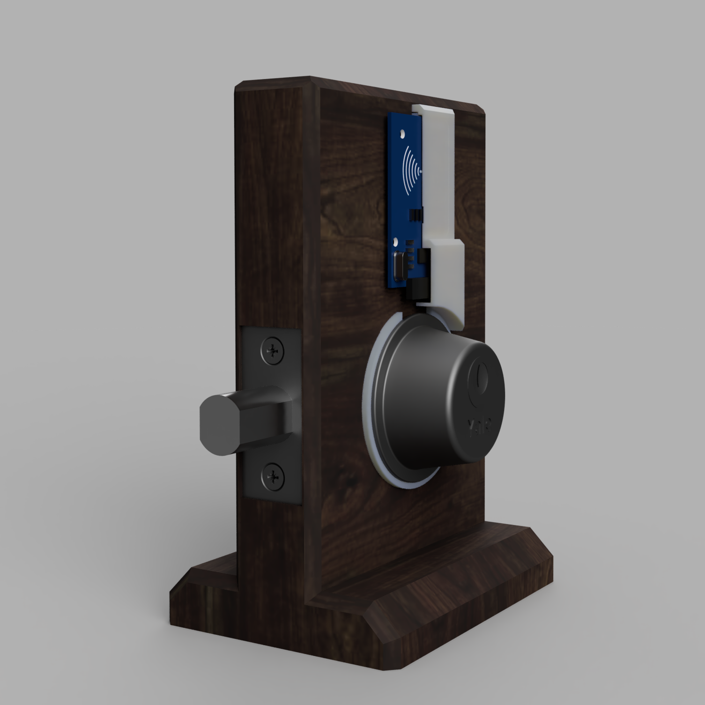

# Smart RFID Door Lock Project Design Requirements and Specifications

Authors:
Miles Breslin, Miguel Higgins Moy, Noah Page, John Sharpe

October 15, 2020

Version 2.0

# Executive Summary

The goal of this project is to make an RFID smart door lock mechanism for residential use that is secure, easy to install, low cost, and that will work with standard doorlock mechanisms. This would offer customers the versatility of entering their homes using a normal key, or an RFID enabled phone, implant, or keycard. By tapping the RFID card against the RFID reader on the outside of the door, the user can easily toggle between locking and unlocking the door. 

# Market Analysis

Solution 1 - Level Bolt

* Not visible on the outside/inside of the door
* Great battery life
* Easy battery changes
* Bluetooth only
* Lacks internet connectivity
* Lacks an RFID/NFC sensor
* Depends on Bolt app and server support
* Expensive! - $229

Solution 2 - August Wi-Fi Smart Lock

* Not visible on the outside of the door
* Easiest installation
* Great battery life
* Easy battery changes
* Not compatible with all doors
* Wifi and Bluetooth only
* Lacks an RFID/NFC sensor
* Depends on August app and server support
* Expensive! - $249.99

Solution 3 - Most other smart locks

* Replaces entire lock assembly
* Has a pin-pad on the outside (therefore ugly and not discrete)
* Not always able to use existing lock
* Lacks an RFID/NFC sensor
* Less expensive, but still over $100

The smart lock solutions listed here do not use RFID/NFC as a method for unlocking, and existing solutions that do use RFID are mainly focused on enterprise customers who are able to build out integrated locking methods into the door and frame that require a central controller for multiple doors. These methods are not only expensive, but not feasible for a standard consumer. Our design will offer standard consumers an RFID enabled smart lock that does not require a subscription at a lower price than most other smart locks, which start at around $150. Our current estimate on parts is about $60, so we feel that we could sell the product for around $100. This price is well below our competition and leaves us some headroom to increase the price if production costs exceed our current estimate.

# Requirements

* Must lock and unlock a door
* Must be able to work with existing doors
* Must be able to work without an internet connection
* Should be able to work with existing locks
* Should be able to use a normal key
* Should be able to lock/unlock from the inside by physical means
* Should be able to last for multiple years
* Should be durable
* Should be cheaper than market offerings (<$150)
* Should be able to work during a power outage
* Should be reliable
* May be easy to install
* May have a decent battery life
* May have smart home integration

# System Architecture

### RFID Door Lock Block Diagram

# Design Specification

* 3D printed housing that does not affect the structural integrity of the existing lock
* Custom PCB for ESP-12F Module to connect actuator and sensor
* Servo as the actuator
* RC-522 module located on the outside of the door
* AA battery powered
* Programmed in Arduino IDE

# Progress So Far

### 3D printed door model and outer door housing

### Render of current CAD work with RC522 and outer door housing

