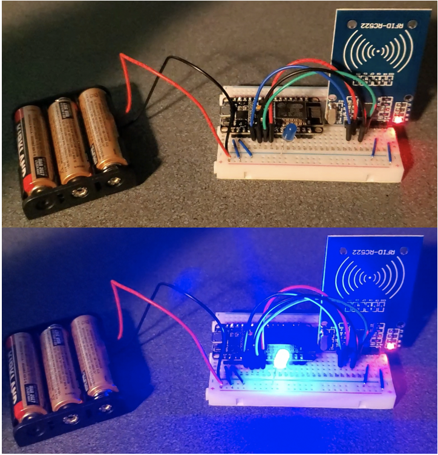
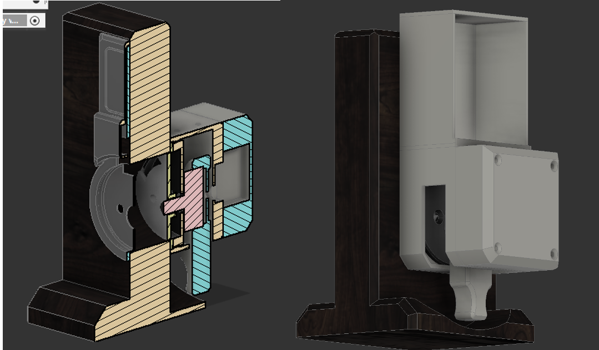
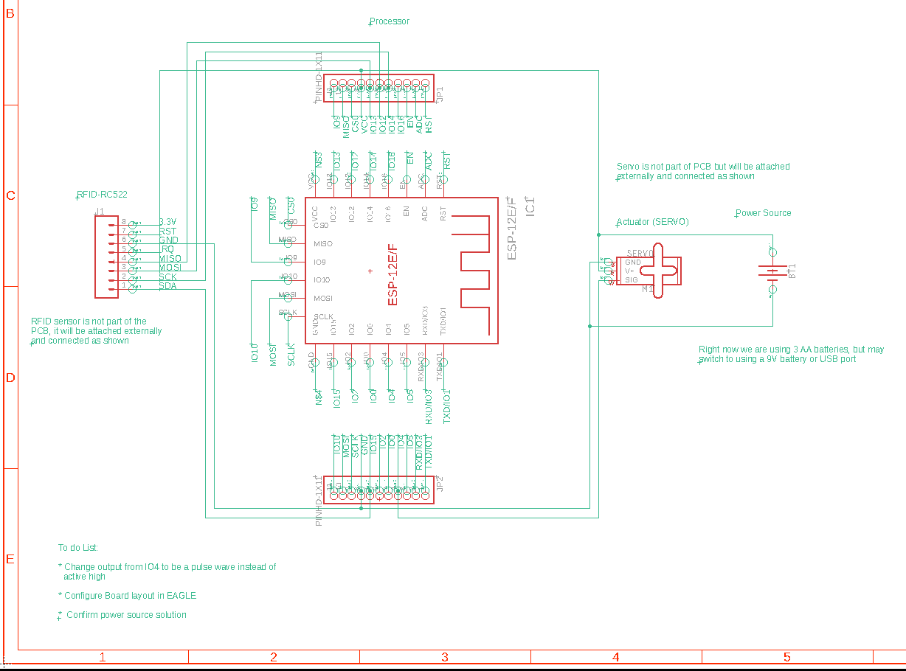

# Breadboard Prototype and Preliminary Schematic

### Part 1: Prototype Design

Current Status:

### Electronic Components:
The processor reads and identifies different RFID cards flawlessly. Output logic signal from reading an RFID card needs to be changed 
from active high to edge triggered. Power source has not been finalized, but the servo and processor can run on 3.3V 
(although a slightly higher voltage would be preferred), allowing for use of AA or 9V batteries, or USB to power the system. 

##### Prototype Circuit responding to RFID card (substituting LED for servo as actuator)

[Video of trying out circuit](./imgs/Doorlock.mp4)

### Housing:
A CAD model has been designed and 3D printed to hold the door-lock and electronic components. This model may be refined slightly, 
but is close to its final iteration.

### Part 2: Preliminary Schematic

[Check out our Eagle CAD files](./../EagleCAD/Schematic/EAGLESchematic.zip)
